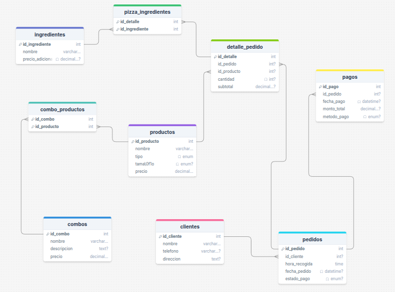

La pizzería "Pizza Fiesta" requiere el desarrollo de una base de datos para gestionar de manera eficiente sus operaciones diarias. El sistema debe permitir el registro y manejo de clientes, productos (pizzas, bebidas e ingredientes), y pedidos. A su vez, la base de datos debe controlar los ingredientes utilizados en cada pizza, así como manejar los precios para pizzas de distintos tamaños (pequeñas, medianas y grandes), tanto individuales como enteras. Adicionalmente, el sistema debe gestionar el pago y la recogida de los pedidos, asegurando que los pedidos se preparen solo una vez confirmado el pago.

Problema:
Actualmente, "Pizza Fiesta" no tiene una forma eficaz de gestionar sus operaciones, lo que genera dificultades en el seguimiento de pedidos, el control de inventario de ingredientes y el manejo de precios según el tipo de pizza y tamaño. Además, los clientes no tienen la posibilidad de personalizar su pedido de manera clara, lo que afecta la experiencia del usuario. La pizzería necesita una solución que automatice estas tareas y facilite la gestión de los pedidos y el inventario de productos.

Características Principales:
Gestión de Clientes: El sistema debe permitir el registro de información detallada de los clientes, incluyendo nombre, número de contacto y dirección.
Gestión de Productos:
Registro de pizzas disponibles (pequeñas, medianas y grandes) y bebidas.
Gestión de ingredientes, permitiendo la personalización de pizzas por parte de los clientes.
Control de combos que incluyan pizzas y bebidas.
Gestión de Pedidos:
Los clientes podrán realizar pedidos que se procesarán tras el pago.
La hora de recogida debe ser indicada por el cliente al hacer el pedido.
Posibilidad de añadir ingredientes extra, aplicando un costo adicional.
Detallado del Pedido:
El sistema debe detallar el proceso de preparación de cada pizza, permitiendo al cliente seleccionar los ingredientes disponibles para personalizar su pizza.
Visualización de costos según el tamaño de la pizza y los ingredientes añadidos.
Pagos y Recogida: Los pedidos solo comenzarán a prepararse una vez realizado el pago, sin costos adicionales, ya que los clientes recogen personalmente su orden.

ESTRUCTURA DE BASE DE DATOS 

E